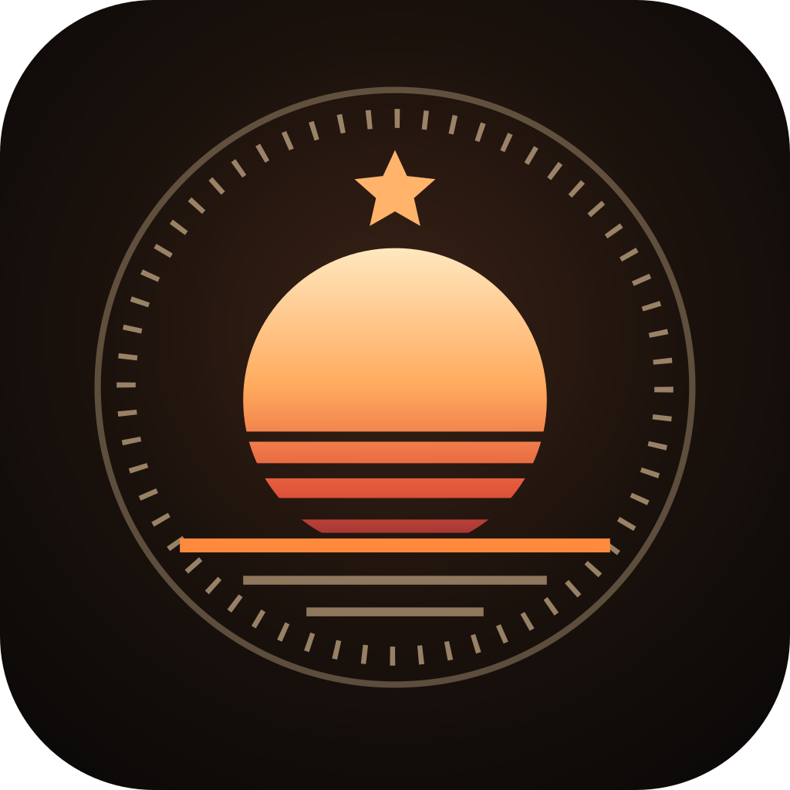
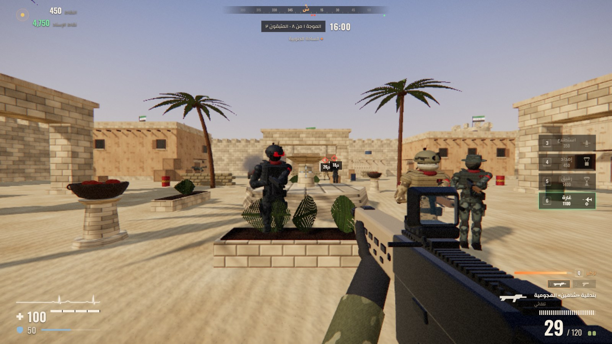
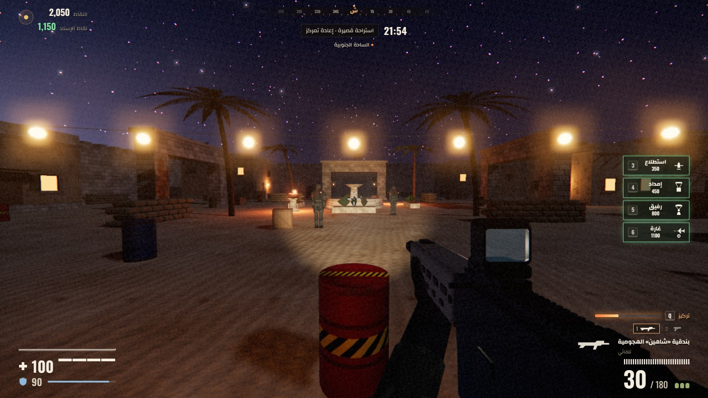
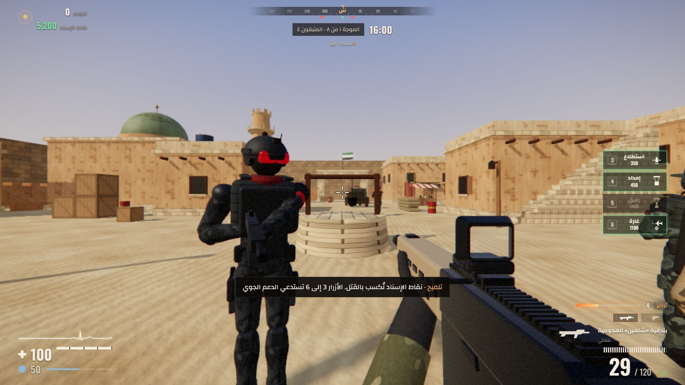
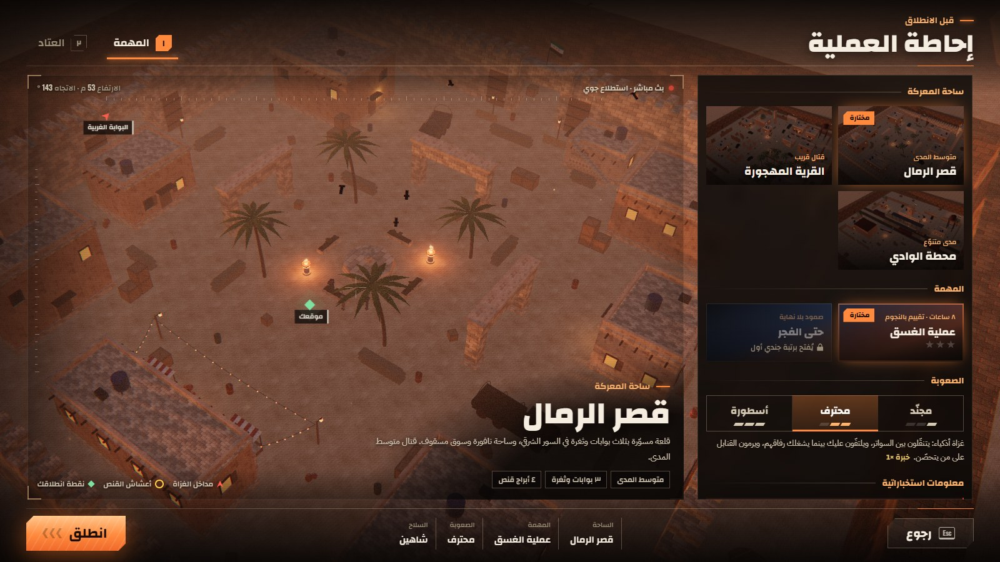
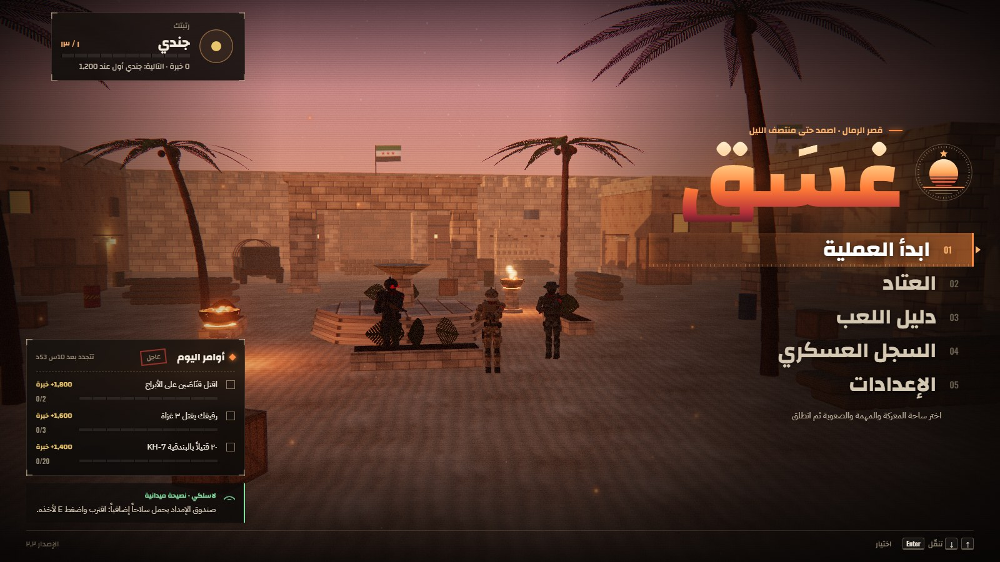

<p align="center">
  
</p>

<h1 align="center">Ghasaq <sub>غَسَق</sub></h1>

<p align="center">
  <b>Hold the fortress from 16:00 to midnight.</b><br />
  An Arabic-language, first-person survival shooter that runs in the browser.<br />
  Built with Three.js, cannon-es and Vite. Every texture, model and sound is generated in code.
</p>

<p align="center">
  
</p>

---

## About

Ghasaq (Arabic for *dusk*) is a wave-survival shooter. You and your squad defend a desert position while the sun sets in front of you: a new wave of raiders attacks every in-game hour, from 16:00 until midnight, and the light, the enemy and the music all get harder as the night comes in.

The whole game is in Arabic and laid out right to left, from the menus to the radio chatter. It needs no installation and no downloads of art or audio: there are **no image or sound files in the project**. Textures are painted on canvases, models are assembled from primitives, and the sound effects and music are synthesised with the Web Audio API.

## Features

- **Eight waves, one evening.** Defend from 16:00 to midnight in *Operation Dusk*, or play *Until Dawn*, which never ends. Three difficulties: Recruit, Professional and Legend.
- **Raiders that fight like players.** They run between cover, peek and shoot, flank while others pin you down, throw grenades at anyone who hides too long, and hear your footsteps and shots. Snipers glint before they fire, and helicopters rope in squads. On Legend they are fast and accurate.
- **Three maps**, each with its own entry points, sniper nests and a walled interior where supply drops land: the *Sand Citadel*, the *Abandoned Village* and *Valley Station*.
- **Five weapons** with iron sights, red dots and scopes (assault rifle, SMG, shotgun, marksman rifle, pistol), plus a knife, cooked grenades, climbing and vaulting.
- **Air support and allies.** Earn points for kills, then spend them on a recon plane, a parachuted supply crate, an ally dropped by parachute, or an airstrike on a target you mark with binoculars.
- **Focus.** Kills and headshots fill a focus meter; press `Q` to slow time down for a few seconds while you stay fast.
- **A full day and night.** Afternoon light turns to dusk and stars. At night your weapon light (`F`) carries an even cone of light, and sandstorms blind everyone.
- **Adaptive sound.** The music (built on the Hijaz maqam) follows the tension of the fight with stingers for contact, assault and retreat. You hear your own pain and a heartbeat when you drop below 50 HP. Radio traffic and squad banter are shown as text only: nothing is read aloud.
- **Progression.** 13 ranks, 14 medals, daily orders and a service record, all saved in the browser.
- **Keyboard and mouse, gamepad and touch.** Touch controls appear automatically on phones and tablets.

## Screenshots

<table>
  <tr>
    <td width="50%"><br /><sub>Night in the citadel: street lamps, stars, and the weapon light</sub></td>
    <td width="50%"><br /><sub>The Abandoned Village: a raider at the well</sub></td>
  </tr>
  <tr>
    <td><br /><sub>Briefing: a live aerial view of the chosen map, mission and difficulty</sub></td>
    <td><br /><sub>Main menu over the live scene, with rank and daily orders</sub></td>
  </tr>
</table>

## Getting started

You need **Node.js 18 or newer**.

```bash
npm install
npm run dev        # opens http://localhost:5173
```

On Windows you can also double-click `start.bat` (installs the packages on the first run, then starts the game) or `start-mobile.bat` (serves the game on your local network so you can open it from a phone on the same Wi-Fi: open the *Network* address it prints and rotate the phone to landscape).

| Command | What it does |
| --- | --- |
| `npm run dev` | Development server with hot reload |
| `npm run dev:mobile` | Same, but reachable from other devices on your network |
| `npm run build` | Production build in `dist/`, ready for any static host |
| `npm run build:single` | The whole game as one self-contained file, `dist-single/ghasaq.html` (open it directly or send it as is) |
| `npm run preview` | Serves the production build from `dist/` |

## Controls

| Keyboard and mouse | Action |
| --- | --- |
| `W` `A` `S` `D` | Move |
| `Shift` | Sprint; hold your breath while aiming through a scope |
| `C` | Crouch (steadies your aim) |
| `Space` | Jump; toward a crate or ledge (up to about 1.5 m) it climbs |
| Left / right mouse button | Fire / aim down sights |
| `R` | Reload |
| `1` `2` / mouse wheel | Switch weapon |
| `E` | Take the weapon shown above a supply crate |
| Hold `G` | Cook a grenade, release to throw |
| `V` | Knife (always lethal from behind) |
| `Q` | Focus: slow time down |
| `F` | Weapon light |
| `3` `4` `5` `6` | Recon · supply drop · ally · airstrike |
| `Tab` | Tactical map |
| `Esc` / `P` | Pause |

A gamepad works out of the box, and touch players get an on-screen layout (virtual stick on the left, look on the right, drag on the fire button to aim while shooting). The in-game **Guide** lists every control.

## Project structure

```
ghasaq/
├─ index.html              All screens and the HUD markup
├─ vite.config.js          Build configuration
├─ start.bat, start-mobile.bat   Windows launchers
├─ scripts/build-single.mjs      Builds the one-file version
├─ docs/images/            README images
└─ src/
   ├─ main.js              Entry point: loading, wiring buttons to actions
   ├─ config/              The numbers that drive the game
   │  ├─ balance.js        Weapons, enemies, difficulties, waves, support, ranks, medals, maps
   │  └─ settings.js       Player settings and their defaults
   ├─ core/                Renderer, sky and time of day, physics, main loop, shared state
   ├─ world/               Map loader, one file per map (maps/), building pieces, collision,
   │                       navigation grid, physics props, ambient lights, flags and birds
   ├─ entities/            Player, raiders and their AI, allies, the soldier model and animation, ragdolls
   ├─ weapons/             Weapons, their first-person models, grenades
   ├─ vehicles/            Aircraft, the helicopter, parachutes, the supply crate
   ├─ systems/             Waves, air support, pickups, focus, progression, daily challenges, tension
   ├─ fx/                  Particles, explosions, bullet marks, blood, weather, the weapon light
   ├─ audio/               Sound effects, music, heartbeat, pain sounds, radio
   ├─ ui/                  HUD, screens and menus, aerial map previews, armory, touch controls
   ├─ input/               Keyboard and mouse, gamepad
   ├─ styles/              CSS
   └─ dev/autotest.js      Ready-made test scenes (developer tool)
```

## Tuning and extending

| To change | Open |
| --- | --- |
| A weapon's damage, fire rate or ammo | `src/config/balance.js` → `WEAPONS` |
| How hard the raiders are | `src/config/balance.js` → `ENEMY`, `DIFFICULTY`, `waveDef` |
| Cost or duration of air support | `src/config/balance.js` → `SUPPORTS` |
| A map (buildings, cover, entry points, sniper nests) | `src/world/maps/citadel.js`, `village.js` or `station.js` |
| Add a map | Copy a file in `src/world/maps/`, register it in `MAP_DEFS` in `src/world/map.js`, and add its name and description to `MAPS` in `balance.js` |
| Menu text | `index.html` and `src/ui/screens.js` |
| Colours and fonts | `src/styles/base.css` (variables at the top) |
| Default volume | `src/config/settings.js` → `DEFAULTS` |

Each map describes where raiders enter (`spawns`), where the helicopter hovers (`hover`), the sniper nests (`snipers`), your start position (`start`) and the walled interior (`interior`) where supply crates may land, so a crate never falls outside the walls.

## Testing

Append `#autotest-<name>` to the address to jump straight into a ready-made scene, for example `#autotest-combat`, `#autotest-village` or `#autotest-torch-citadel`. Prefix it with `touch-` (`#touch-autotest-combat`) to try the touch layout on a desktop browser. The scenes are listed at the top of `src/dev/autotest.js`.

`#autotest-droptest` runs 400 supply drops from random positions on every map and prints the result to the console. It must report `bad=0`.


## Tech

- [Three.js](https://threejs.org) r170 for rendering, [cannon-es](https://pmndrs.github.io/cannon-es/) for physics, [Vite](https://vitejs.dev) for development and bundling.
- Plain JavaScript modules, no framework. Two runtime dependencies.
- Web Audio synthesis for every sound, including the music.
- The raiders are a fictional invading faction.
